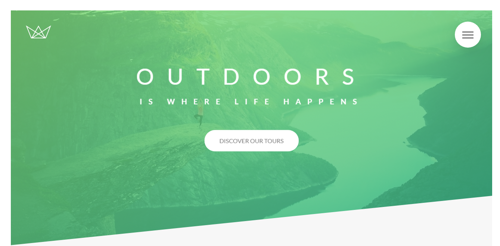

# Natours

Project website from the course [Advanced CSS and Sass: Flexbox, Grid, Animations and More!](https://www.udemy.com/advanced-css-and-sass/)

## [Live Demo](fx-natours.netlify.com)



## Installation

```sh
  git clone https://github.com/facodes/natours.git
  cd natours
  npm install
  npm run dev #runs development server on port 3000
```
